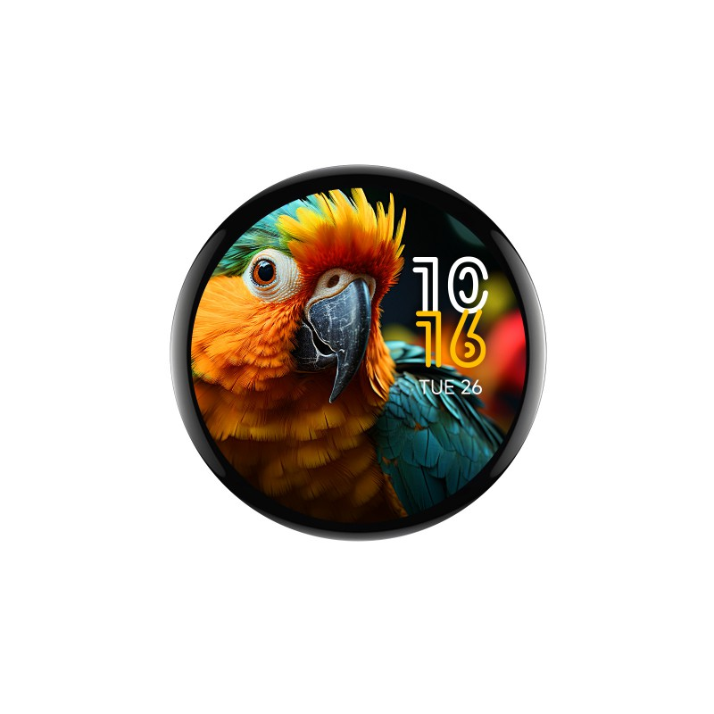

## Product specs

| Feature      | Spec                    |
| ------------ | ----------------------- |
| Screen       | CO5300 driver 466\*466 |
| Touch screen | CST9217                  |
| CPU          | ESP32-S3               |
| Flash        | 16MB                    |
| PSRAM        | 8MB                     |

## Product description

A circular 1.75in / 45mm AMOLED display with touchscreen, esp32s3 microcontroller, and dual microphones with AEC.
Avalible on [Waveshare](https://www.waveshare.com/esp32-s3-touch-amoled-1.75.htm?sku=31261) for ~$30. Case and GPS versions are available.

## Basic Config

```yaml
substitutions:
  name: "waveshare-s3-amoled-175"
  friendly_name: "Waveshare-S3-AMOLED-1.75in"

esphome:
  name: "${name}"
  friendly_name: "${friendly_name}"
  project:
    name: "${project_name}"
    version: "${project_version}"
  platformio_options:
    board_build.flash_mode: dio
    board_build.f_flash: 80000000L
    board_build.f_cpu: 240000000L

esp32:
  board: esp32-s3-devkitc-1
  flash_size: 16MB
  framework:
    type: esp-idf

psram:
  mode: octal
  speed: 80MHz

# Enable logging
logger:

# Enable Home Assistant API
api:
  encryption:
    key: !secret encryption_key

ota:
  - platform: esphome
    password: !secret ota_key

wifi:
  ssid: !secret wifi_ssid
  password: !secret wifi_password

  # Enable fallback hotspot (captive portal) in case wifi connection fails
  ap:
    ssid: "${friendly_name} Fallback Hotspot"
    password: "6T3RFWEF71"

# Include external components
external_components:
  - source: 
      type: git
      url: https://github.com/shelson/esphome-cst9217

# Bus Configuration
i2c:
  - id: bus_a
    sda: GPIO15
    scl: GPIO14
    scan: true

i2s_audio:
  - id: i2s_a
    i2s_lrclk_pin: GPIO45
    i2s_bclk_pin: GPIO9
    i2s_mclk_pin: GPIO42

spi:
  - id: flash_spi
    type: quad
    clk_pin: SPICLK
    data_pins:
      - SPID
      - SPIQ
      - SPIWP
      - SPIHD
  - id: display_qspi
    type: quad
    clk_pin: GPIO38
    data_pins:
      - GPIO4
      - GPIO5
      - GPIO6
      - GPIO7

# Display Configuration
display:
  - platform: mipi_spi
    id: disp1
    model: CO5300
    bus_mode: quad
    reset_pin: GPIO39
    cs_pin: GPIO12
    dimenions:
      height: 466
      width: 466

light:
  - platform: monochromatic
    id: display_backlight
    name: "Backlight"
    output: backlight_brightness
    default_transition_length:
      milliseconds: 0
    initial_state:
      brightness: 81%
    restore_mode:
      ALWAYS_ON

output:
  - platform: template
    id: backlight_brightness
    type: float
    write_action:
      then:
        - lambda: |-
            id(disp1).set_brightness(state*255);

number:
  - platform: template
    name: Display timeout
    optimistic: true
    id: display_timeout
    unit_of_measurement: "s"
    initial_value: 45
    restore_value: true
    min_value: 10
    max_value: 180
    step: 5
    mode: box

# Touchscreen Configuration
touchscreen:
  - platform: cst9217
    display: disp1
    id: ts_disp1
    interrupt_pin: GPIO11
    reset_pin: GPIO40
    transform:
      mirror_x: true
      mirror_y: true
    on_update:
      - lambda: |-
          for (auto touch: touches)  {
              if (touch.state <= 2) {
                 ESP_LOGI("Touch points:", "id=%d x=%d, y=%d", touch.id, touch.x, touch.y);
              }
          }
    on_release:
      - if:
          condition: lvgl.is_paused
          then:
            - logger.log: "LVGL resuming"
            - lvgl.resume:
            - lvgl.widget.redraw:
            - light.turn_on: display_backlight

# LVGL Configuration
lvgl:
  widgets:
    - label:
        align: CENTER
        text: 'Hello World!'
  on_idle:
    timeout: !lambda "return (id(display_timeout).state * 1000);"
    then:
      - logger.log: "LVGL is idle"
      - light.turn_off: display_backlight
      - lvgl.pause:  

```
